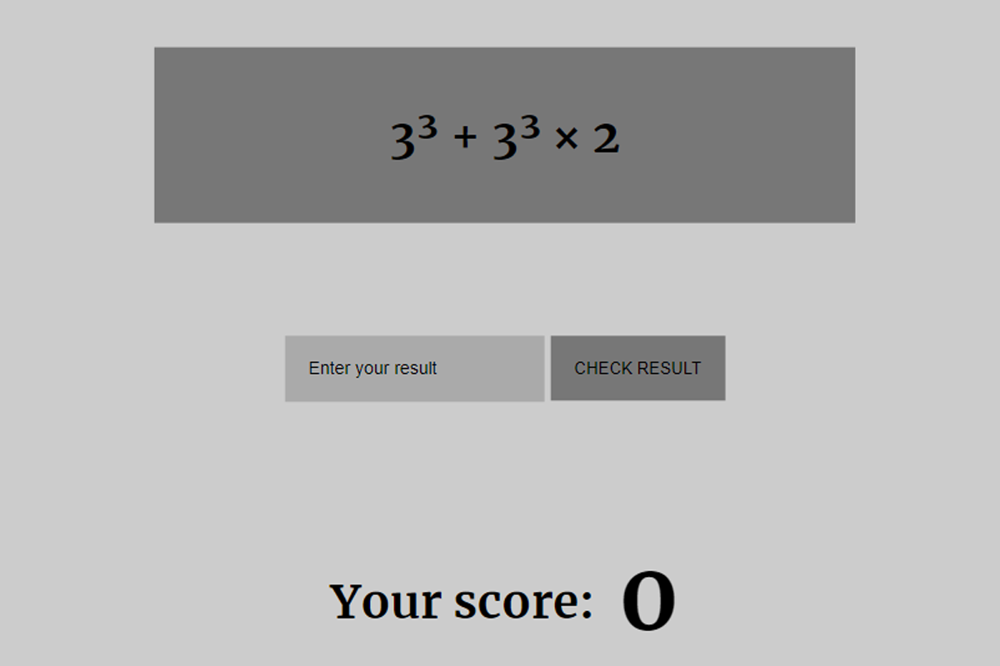

## Table of contents

- [Overview](#overview)
  - [The challenge](#the-challenge)
  - [Screenshot](#screenshot)
  - [Links](#links)
- [My process](#my-process)
  - [Built with](#built-with)
  - [What I learned](#what-i-learned)
  - [Continued development](#continued-development)
- [Author](#author)

## Overview

It is my first small project while learning vanilla Javascript. It is a simple math game where you are given a predetermined random task and you have to enter a correct answer value. If you answer correctly you gain a point, if not, you loose one. Once answered incorrectly, you are allowed to skip the task and go to the next one. Game finishes when you go through 20 tasks and it saves your highest score. You can restart the game and try to beat your high score again.

### Screenshot

### Links

- Live Site URL: [Click on me!](https://lukaskudzevicius.github.io/math-game/)

## My process

My process and problems encountered can be found at 'About the project' on the game site.

### Built with

- HTML
- CSS
- Javascript

### What I learned

Creating and manipulating arrays. Manipulating DOM.

### Continued development

For the future I would like to make the game generate tasks everytime it starts instead of using a list of predetermined ones. But that's for another day.

## Author

Lukas Kudzevicius.
